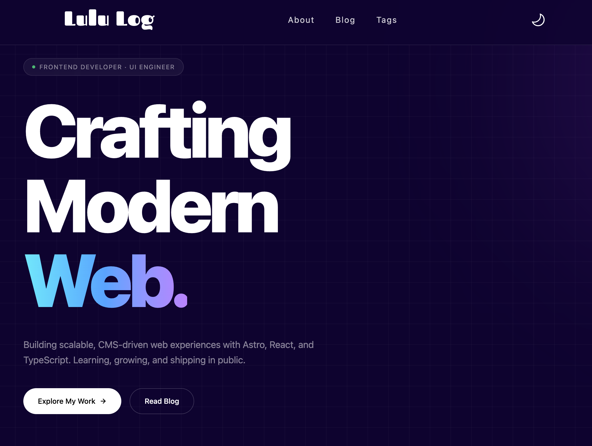
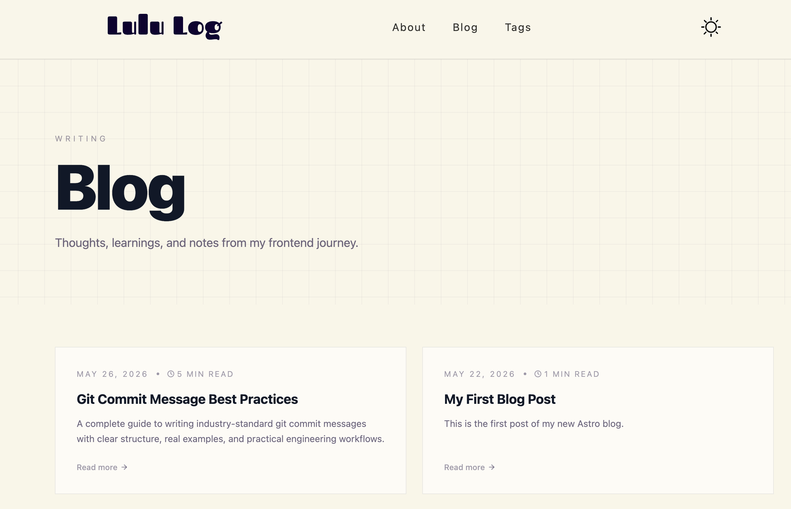
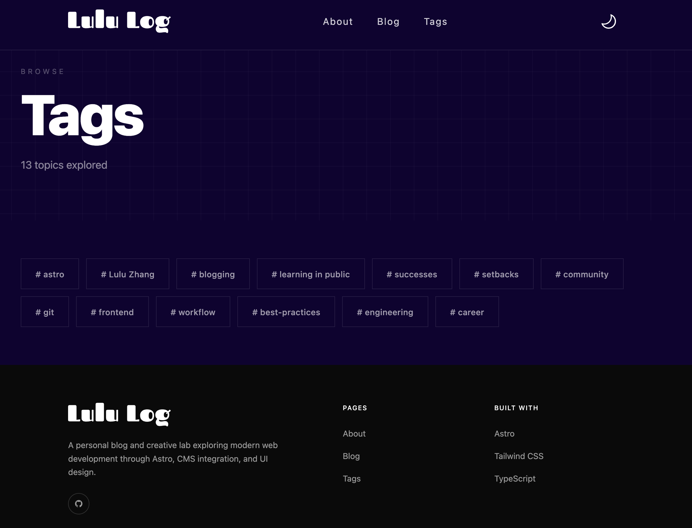

# Lulu Zhang — Personal Blog

A personal blog built with [Astro](https://astro.build), featuring markdown-powered posts, dark mode, tag filtering, and RSS feed.

**Live site:** [astrolulu.netlify.app](https://astrolulu.netlify.app)

## Preview





## Tech Stack

- **[Astro 6](https://astro.build)** — static site generator
- **[Tailwind CSS v4](https://tailwindcss.com)** — utility-first styling
- **[Preact](https://preactjs.com)** — interactive components (e.g. greeting)
- **TypeScript** — type-safe throughout

## Features

- Dark / light mode toggle
- Markdown blog posts via Astro Content Collections
- Estimated reading time per post
- Tag-based filtering (`/tags`, `/tags/[tag]`)
- RSS feed at `/rss.xml`
- Sticky frosted-glass header
- Responsive mobile navigation
- Modern styled tables in prose content
- Custom code block UI with language labels

## Project Structure

```
src/
├── blog/               # Markdown post files
├── components/         # Astro & Preact components
├── layouts/
│   ├── BaseLayout.astro
│   └── MarkdownPostLayout.astro
├── pages/
│   ├── index.astro
│   ├── blog.astro
│   ├── about.astro
│   ├── 404.astro
│   ├── rss.xml.ts
│   ├── posts/[...slug].astro
│   └── tags/
│       ├── index.astro
│       └── [tag].astro
├── scripts/
│   └── menu.ts
├── styles/
│   └── global.css
└── utils/
    └── readingTime.ts
```

## Commands

| Command           | Action                                      |
| :---------------- | :------------------------------------------ |
| `npm install`     | Install dependencies                        |
| `npm run dev`     | Start dev server at `localhost:4321`        |
| `npm run build`   | Type-check and build to `./dist/`           |
| `npm run preview` | Preview the production build locally        |

## Writing a Post

Add a `.md` file to `src/blog/` with the following frontmatter:

```markdown
---
title: "Your Post Title"
author: Lulu Zhang
pubDate: 2026-06-03
description: "A short description shown in cards and meta."
tags: ["tag-one", "tag-two"]
image:
  url: "https://..."
  alt: "Image description"
---

Your content here.
```

The post will be available at `/posts/<filename>`.
